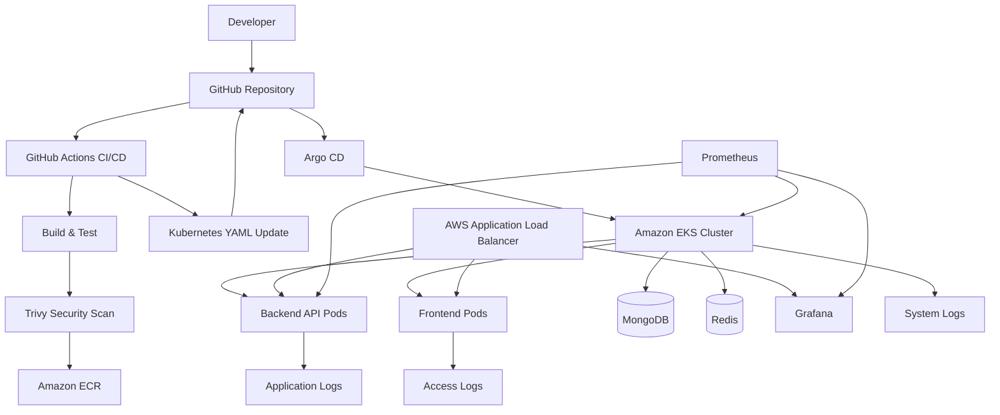
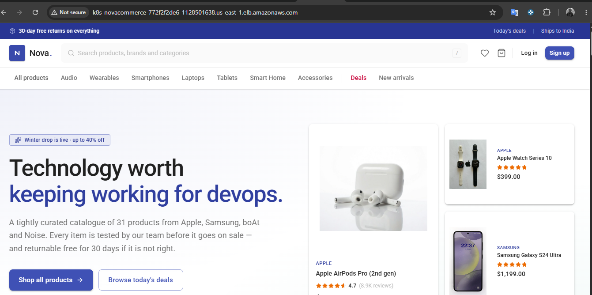
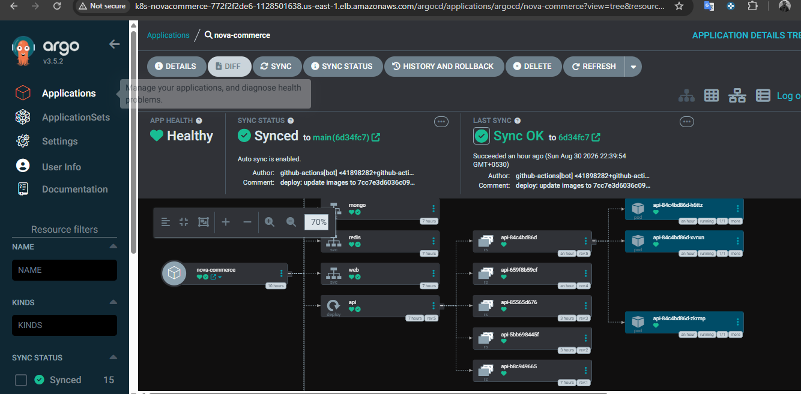
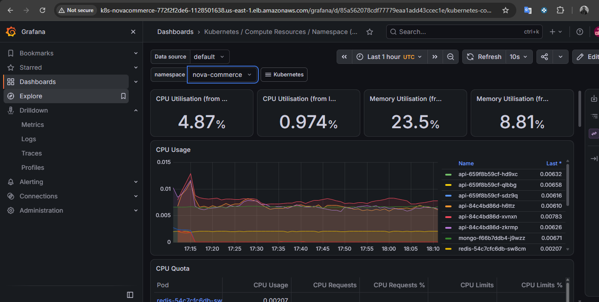
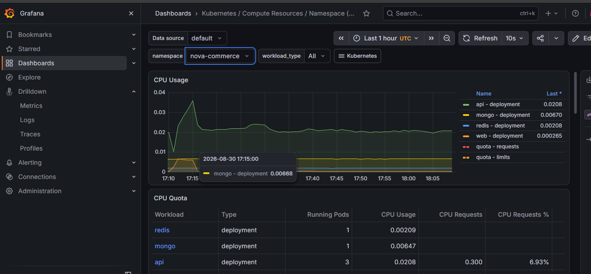

# Nova Commerce --- DevOps Assignment

## 1. Project Overview

Nova Commerce is a containerized e-commerce application deployed on
Kubernetes and automated using a CI/CD workflow.

The project demonstrates:

-   Application containerization with Docker
-   Amazon ECR for container image storage
-   Amazon EKS for Kubernetes deployment
-   Kubernetes manifests stored in the repository
-   GitHub Actions for CI/CD
-   Trivy container image security scanning
-   Argo CD for GitOps-based deployment
-   AWS Application Load Balancer (ALB) for external access
-   Prometheus for metrics collection
-   Grafana for metrics visualization
-   Kubernetes `ServiceMonitor` for application monitoring

The deployment approach uses **plain Kubernetes YAML manifests**, not
Helm for the application deployment.

------------------------------------------------------------------------

# 2. High-Level Architecture



------------------------------------------------------------------------

# 3. Technology Stack

  Area                    Technology
  ----------------------- ------------------------------------
  Source Control          GitHub
  CI/CD                   GitHub Actions
  Containerization        Docker
  Container Registry      Amazon ECR
  Kubernetes              Amazon EKS
  Kubernetes Deployment   YAML manifests
  GitOps                  Argo CD
  Ingress                 AWS Load Balancer Controller / ALB
  Metrics                 Prometheus
  Dashboards              Grafana
  Application Metrics     `prom-client`
  Security Scanning       Trivy
  Backend                 Node.js
  Frontend                Node.js / Nginx
  Database                MongoDB
  Cache                   Redis
  Infrastructure          AWS

------------------------------------------------------------------------

# 4. Repository Structure

The important project structure is:

``` text
nova-commerce/
│
├── .github/
│   └── workflows/
│       └── ci-cd.yml
│
├── backend/
│   ├── Dockerfile
│   ├── package.json
│   └── src/
│       ├── app.js
│       └── server.js
│
├── frontend/
│   ├── package.json
│   └── ...
│
├── nginx/
│   └── Dockerfile
│
├── kubernetes/
│   ├── api-deploy.yaml
│   ├── api-service.yaml
│   ├── api-servicemonitor.yaml
│   ├── web-deploy.yaml
│   ├── web-service.yaml
│   ├── ingress.yaml
│   ├── storageclass.yaml
│   └── ...
│
└── README.md
```

The exact filenames may differ if additional Kubernetes resources have
been added.

------------------------------------------------------------------------

# 5. CI/CD Pipeline

The project uses a single GitHub Actions workflow containing CI and CD
jobs.

The workflow is triggered by:

``` yaml
on:
  push:
    branches:
      - main

  pull_request:
    branches:
      - main
```

The pipeline is divided into:

1.  CI
2.  CD / Kubernetes manifest update
3.  Argo CD synchronization

------------------------------------------------------------------------

# 6. Continuous Integration

## 6.1 Checkout

GitHub Actions checks out the repository:

``` yaml
- name: Checkout code
  uses: actions/checkout@v4
  with:
    fetch-depth: 0
```

`fetch-depth: 0` allows the workflow to access the complete Git history.

------------------------------------------------------------------------

## 6.2 Node.js Setup

The project uses Node.js 22:

``` yaml
- name: Setup Node.js
  uses: actions/setup-node@v4
  with:
    node-version: "22"
```

------------------------------------------------------------------------

## 6.3 Frontend Validation

Frontend dependencies are installed and the application is built:

``` bash
npm ci
npm run build
```

This validates that the frontend can be installed and successfully
compiled.

------------------------------------------------------------------------

## 6.4 Backend Validation

Backend dependencies are installed:

``` bash
npm ci
```

JavaScript syntax is validated:

``` bash
node --check src/server.js
node --check src/app.js
```

------------------------------------------------------------------------

# 7. Docker Image Build

Two container images are produced.

## Backend

The backend image is built from:

``` text
backend/Dockerfile
```

Example:

``` bash
docker build \
  -t $ECR_REGISTRY/nova-commerce/backend:${GITHUB_SHA} \
  -f backend/Dockerfile \
  ./backend
```

## Frontend

The frontend image is built using:

``` text
nginx/Dockerfile
```

Example:

``` bash
docker build \
  -t $ECR_REGISTRY/nova-commerce/frontend:${GITHUB_SHA} \
  -f nginx/Dockerfile \
  .
```

------------------------------------------------------------------------

# 8. Image Tagging Strategy

Images are tagged using the Git commit SHA:

``` text
<GITHUB_SHA>
```

Example:

``` text
905418141604.dkr.ecr.us-east-1.amazonaws.com/nova-commerce/backend:<commit-sha>
```

This is preferable to relying on:

``` text
latest
```

because every deployment points to an immutable version of the
application.

Benefits:

-   Easy rollback
-   Traceability
-   Reproducibility
-   No ambiguity about which version is deployed

------------------------------------------------------------------------

# 9. Amazon ECR

AWS credentials are configured in GitHub Actions:

``` yaml
- name: Configure AWS credentials
  uses: aws-actions/configure-aws-credentials@v4
```

The workflow logs into ECR:

``` yaml
- name: Login to Amazon ECR
  uses: aws-actions/amazon-ecr-login@v2
```

Images are pushed to:

``` text
nova-commerce/backend
nova-commerce/frontend
```

------------------------------------------------------------------------

# 10. Container Security with Trivy

Before images are pushed to ECR, they are scanned using Trivy.

Example:

``` yaml
- name: Scan backend image
  uses: aquasecurity/trivy-action@0.35.0
  with:
    image-ref: ${{ env.ECR_REGISTRY }}/nova-commerce/backend:${{ github.sha }}
    format: table
    exit-code: 1
    severity: HIGH,CRITICAL
    ignore-unfixed: true
```

The same approach is used for the frontend image.

The pipeline fails when fixable `HIGH` or `CRITICAL` vulnerabilities are
detected.

This creates a security gate before deployment.

------------------------------------------------------------------------

# 11. Continuous Deployment

After CI succeeds:

``` yaml
deploy:
  needs: ci
```

The CD job checks out the repository and updates Kubernetes manifests
with the new image tag.

Backend:

``` text
kubernetes/api-deploy.yaml
```

Frontend:

``` text
kubernetes/web-deploy.yaml
```

The image reference is changed from an old version to:

``` text
<ECR_REGISTRY>/nova-commerce/backend:<GITHUB_SHA>
```

and:

``` text
<ECR_REGISTRY>/nova-commerce/frontend:<GITHUB_SHA>
```

------------------------------------------------------------------------

# 12. GitOps Deployment Flow

The deployment flow is:

``` text
Developer
    |
    v
GitHub
    |
    v
GitHub Actions
    |
    +---- Build
    |
    +---- Test
    |
    +---- Trivy
    |
    +---- Push images to ECR
    |
    +---- Update Kubernetes YAML
    |
    v
Git commit
    |
    v
GitHub main branch
    |
    v
Argo CD detects change
    |
    v
Argo CD sync
    |
    v
Amazon EKS
```

The important principle is:

> Git is the source of truth for the Kubernetes desired state.

Argo CD continuously compares the desired state in Git with the live
state in Kubernetes.

------------------------------------------------------------------------

# 13. Argo CD

Argo CD is configured to monitor the repository.

The application is:

``` text
nova-commerce
```

Important configuration:

``` text
Repository:
https://github.com/Umarkhan803/e-commers-for-devops.git

Target Revision:
main

Path:
kubernetes

Destination:
in-cluster

Namespace:
nova-commerce
```

When GitHub Actions updates the Kubernetes manifests and pushes the
commit, Argo CD detects the change.

Argo CD then reconciles the Kubernetes cluster.

This removes the need for GitHub Actions to directly run:

``` bash
kubectl apply
```

The Git repository remains the deployment source of truth.

------------------------------------------------------------------------

# 14. Kubernetes

The application is deployed using Kubernetes YAML files.

The project does **not** use Helm for the application deployment.

The Kubernetes directory contains the desired resources.

Typical resources include:

``` text
Deployment
Service
Ingress
PersistentVolumeClaim
StorageClass
ServiceMonitor
```

------------------------------------------------------------------------

# 15. Backend Deployment

The backend is deployed using:

``` text
kubernetes/api-deploy.yaml
```

The application listens on:

``` text
4000
```

The Kubernetes container port is:

``` yaml
containerPort: 4000
```

The backend service exposes:

``` text
4000
```

------------------------------------------------------------------------

# 16. Frontend Deployment

The frontend is deployed using:

``` text
kubernetes/web-deploy.yaml
```

The frontend is served through Nginx.

The frontend container is exposed through its Kubernetes Service.

------------------------------------------------------------------------

# 17. Kubernetes Services

The backend uses a Kubernetes Service to provide stable internal
connectivity.

Example:

``` yaml
apiVersion: v1
kind: Service
metadata:
  name: api
spec:
  selector:
    app: api
  ports:
    - name: api
      port: 4000
      targetPort: 4000
```

The Service selects pods using:

``` yaml
selector:
  app: api
```

This means Kubernetes sends traffic to pods having:

``` yaml
labels:
  app: api
```

------------------------------------------------------------------------

# 18. AWS Application Load Balancer

External traffic is handled through an AWS Application Load Balancer.

The Kubernetes Ingress uses:

``` yaml
ingressClassName: alb
```

The ALB is internet-facing.

The architecture is:

``` text
Internet
   |
   v
AWS ALB
   |
   +---- Frontend Service
   |
   +---- Backend Service
   |
   +---- Grafana Service
```

The ALB provides the external entry point while Kubernetes Services
provide internal routing.

------------------------------------------------------------------------

# 19. Grafana Through ALB

Grafana was exposed through an ALB path:

``` text
/grafana
```

The Grafana service is:

``` text
monitoring-grafana
```

The service listens on:

``` text
80
```

and forwards to the Grafana pod on:

``` text
3000
```

The Grafana ingress uses:

``` yaml
alb.ingress.kubernetes.io/backend-protocol: HTTP
alb.ingress.kubernetes.io/target-type: ip
alb.ingress.kubernetes.io/scheme: internet-facing
```

Health checking was configured using:

``` text
/api/health
```

------------------------------------------------------------------------

# 20. Monitoring Architecture

The monitoring stack uses Prometheus and Grafana.

``` text
Kubernetes Cluster
        |
        +-------------------+
        |                   |
        v                   v
 Kubernetes Metrics     Application Metrics
        |                   |
        |                   v
        |              Backend /metrics
        |                   |
        +---------> Prometheus
                         |
                         v
                      Grafana
                         |
                         v
                    Dashboards
```

------------------------------------------------------------------------

# 21. Prometheus

Prometheus is deployed in the `monitoring` namespace.

The Prometheus resource is:

``` text
monitoring-kube-prometheus-prometheus
```

Prometheus was verified as ready using:

``` bash
kubectl get prometheus -n monitoring
```

The Prometheus server returned:

``` text
Prometheus Server is Ready.
```

This confirms that the Prometheus server itself is running correctly.

------------------------------------------------------------------------

# 22. ServiceMonitor

The Prometheus Operator uses `ServiceMonitor` resources to discover
Kubernetes services that expose metrics.

The project includes:

``` text
kubernetes/api-servicemonitor.yaml
```

The resource:

``` text
api-monitor
```

exists in the:

``` text
nova-commerce
```

namespace.

It is intended to configure Prometheus to scrape the backend application
metrics endpoint.

------------------------------------------------------------------------

# 23. Application Metrics

The backend uses a Prometheus Node.js client library.

The project installed:

``` bash
npm install prom-client
```

The installed version during implementation was:

``` text
prom-client@15.1.3
```

The npm output indicated that `prom-client` has been replaced by:

``` text
@prometheus-io/client
```

For future maintenance, the project should evaluate migrating to the
current package.

------------------------------------------------------------------------

# 24. Recommended Application Metrics

The backend should expose a metrics endpoint:

``` text
/metrics
```

The endpoint should return Prometheus-formatted metrics.

Useful application metrics include:

### Request count

``` text
http_requests_total
```

### Request duration

``` text
http_request_duration_seconds
```

### Request rate

PromQL:

``` promql
rate(http_requests_total[5m])
```

### Error rate

For HTTP 5xx responses:

``` promql
rate(http_requests_total{status_code=~"5.."}[5m])
```

### Average latency

``` promql
rate(http_request_duration_seconds_sum[5m])
/
rate(http_request_duration_seconds_count[5m])
```

These metrics satisfy the application monitoring requirements:

-   Request rate
-   Error rate
-   Latency

------------------------------------------------------------------------

# 25. Infrastructure Metrics

Prometheus collects Kubernetes and node-level metrics through the
kube-prometheus-stack components.

Useful CPU query:

``` promql
100 * (1 - avg(rate(node_cpu_seconds_total{mode="idle"}[5m])))
```

The PromQL syntax requires correct label matching:

``` text
{mode="idle"}
```

not:

``` text
{mode:"idle"}
```

This was an issue encountered while creating the Grafana dashboard.

Useful memory query:

``` promql
100 *
(
  1 -
  node_memory_MemAvailable_bytes
  /
  node_memory_MemTotal_bytes
)
```

Useful disk usage query:

``` promql
100 *
(
  1 -
  node_filesystem_avail_bytes
  /
  node_filesystem_size_bytes
)
```

Disk queries should normally exclude temporary and virtual filesystems.

------------------------------------------------------------------------

# 26. Database Metrics

Database monitoring should cover MongoDB and Redis.

## MongoDB

Recommended metrics:

-   Connections
-   Operations per second
-   Query latency
-   Memory usage
-   Disk usage
-   Replication status
-   Available connections

A MongoDB exporter can be used to expose MongoDB metrics to Prometheus.

## Redis

Recommended metrics:

-   Connected clients
-   Memory usage
-   Commands per second
-   Cache hit/miss ratio
-   Evicted keys
-   Keyspace statistics

A Redis exporter can be used to expose Redis metrics to Prometheus.

### Current project status

Prometheus and Grafana infrastructure has been deployed, but
database-specific exporter metrics should be considered an additional
implementation step if MongoDB and Redis metrics are not already
exposed.

------------------------------------------------------------------------

# 27. Grafana

Grafana is used as the visualization layer.

The Grafana service is:

``` text
monitoring-grafana
```

The Grafana pod was verified as running:

``` bash
kubectl get pods -n monitoring
```

The Grafana pod was observed in:

``` text
Running
```

Grafana is connected to Prometheus as a datasource.

------------------------------------------------------------------------

# 28. Grafana Dashboard 1 --- Infrastructure

A meaningful infrastructure dashboard should contain at least:

### CPU Usage

``` promql
100 * (1 - avg(rate(node_cpu_seconds_total{mode="idle"}[5m])))
```

Visualization:

``` text
Time series
```

------------------------------------------------------------------------

### Memory Usage

``` promql
100 *
(
  1 -
  node_memory_MemAvailable_bytes
  /
  node_memory_MemTotal_bytes
)
```

------------------------------------------------------------------------

### Disk Usage

``` promql
100 *
(
  1 -
  node_filesystem_avail_bytes
  /
  node_filesystem_size_bytes
)
```

------------------------------------------------------------------------

### Node Availability

``` promql
up{job=~".*node.*"}
```

This dashboard provides visibility into infrastructure health.

------------------------------------------------------------------------

# 29. Grafana Dashboard 2 --- Application

The second dashboard should focus on the backend.

Recommended panels:

### Request Rate

``` promql
sum(rate(http_requests_total[5m]))
```

------------------------------------------------------------------------

### Error Rate

``` promql
sum(rate(http_requests_total{status_code=~"5.."}[5m]))
```

------------------------------------------------------------------------

### Average Latency

``` promql
rate(http_request_duration_seconds_sum[5m])
/
rate(http_request_duration_seconds_count[5m])
```

------------------------------------------------------------------------

### Backend Availability

``` promql
up{job=~".*api.*"}
```

This dashboard provides application-level visibility.

------------------------------------------------------------------------

# 30. Centralized Logging

Centralized logging should collect three categories.

## Application Logs

Backend application logs:

``` text
Node.js application
```

Frontend/application access logs:

``` text
Nginx
```

## System Logs

Kubernetes node/system logs should be collected from:

``` text
/var/log
```

## Access Logs

Ingress / ALB / Nginx access logs can be used for traffic analysis.

A production implementation can use a logging stack such as:

``` text
Fluent Bit
    |
    v
OpenSearch / Elasticsearch
    |
    v
Kibana / OpenSearch Dashboards
```

or a Loki-based design:

``` text
Fluent Bit / Promtail
        |
        v
      Loki
        |
        v
     Grafana
```

### Current project status

Prometheus/Grafana monitoring was implemented and tested.

Centralized logging is documented as the next monitoring component if a
log aggregation backend has not yet been deployed.

Do not claim centralized logging is complete until logs can be searched
from the centralized logging system.

------------------------------------------------------------------------

# 31. Health Checks

The backend Kubernetes deployment contains health probes.

The health endpoint used by the application is:

``` text
/api/v1/health
```

Example readiness configuration:

``` yaml
readinessProbe:
  httpGet:
    path: /api/v1/health
    port: 4000
```

Health checks allow Kubernetes to determine whether a pod is ready to
receive traffic.

------------------------------------------------------------------------

# 32. Troubleshooting Performed

## 32.1 ECR `latest` ImagePullBackOff

An issue occurred where Kubernetes attempted to pull:

``` text
nova-commerce/backend:latest
```

The image did not exist in ECR.

The correct approach is to use the Git SHA tag:

``` text
nova-commerce/backend:<GITHUB_SHA>
```

The CI/CD workflow was updated to write the SHA into the Kubernetes
deployment manifest.

------------------------------------------------------------------------

## 32.2 GitHub Actions Push Permission Error

GitHub Actions initially failed with:

``` text
Permission to ... denied to github-actions[bot]
```

The workflow was updated with:

``` yaml
permissions:
  contents: write
```

This allows the GitHub Actions token to commit and push Kubernetes
manifest changes.

Repository permissions must also allow GitHub Actions to write to
repository contents.

------------------------------------------------------------------------

## 32.3 Git Pull Conflict

Local Kubernetes changes prevented:

``` bash
git pull
```

from completing.

Git reported:

``` text
Your local changes ... would be overwritten by merge
```

The changes were handled with Git stash operations.

The correct workflow is:

``` bash
git status
git stash
git pull
git stash pop
```

Only use this when the local changes are intentionally preserved.

------------------------------------------------------------------------

## 32.4 Argo CD YAML Parsing Error

Argo CD reported:

``` text
failed to unmarshal "api-deploy.yaml"
```

and:

``` text
yaml: line 20: mapping values are not allowed in this context
```

The deployment manifest was inspected and corrected.

The image line must remain valid YAML:

``` yaml
image: 905418141604.dkr.ecr.us-east-1.amazonaws.com/nova-commerce/backend:<tag>
```

A malformed image value or indentation can cause Argo CD manifest
generation to fail.

------------------------------------------------------------------------

## 32.5 Grafana Port Forwarding

Grafana was initially tested with:

``` bash
kubectl port-forward -n monitoring svc/monitoring-grafana 3000:80
```

The port-forward reported:

``` text
Forwarding from 127.0.0.1:3000 -> 3000
```

If the browser reports:

``` text
ERR_CONNECTION_REFUSED
```

the most common causes are:

-   Port forwarding process stopped
-   Browser opened a different environment
-   CloudShell/remote environment is being used
-   Local browser cannot access the remote localhost
-   The port-forward terminal was closed

The ALB ingress provides a more appropriate external access method for
the deployed environment.

------------------------------------------------------------------------

# 33. Important Kubernetes Debugging Commands

Check all pods:

``` bash
kubectl get pods -A
```

Check application pods:

``` bash
kubectl get pods -n nova-commerce
```

Check monitoring pods:

``` bash
kubectl get pods -n monitoring
```

Check services:

``` bash
kubectl get svc -A
```

Check ingress:

``` bash
kubectl get ingress -A
```

Describe a resource:

``` bash
kubectl describe pod <pod-name> -n <namespace>
```

Check pod logs:

``` bash
kubectl logs <pod-name> -n <namespace>
```

Check deployment:

``` bash
kubectl get deployment -n nova-commerce
```

Check ServiceMonitor:

``` bash
kubectl get servicemonitor -n nova-commerce
```

Check Prometheus:

``` bash
kubectl get prometheus -n monitoring
```

Check Prometheus targets:

``` bash
kubectl run curl-prometheus --rm -it \
  --image=curlimages/curl \
  --restart=Never \
  -- sh
```

Then:

``` bash
curl http://monitoring-kube-prometheus-prometheus.monitoring.svc.cluster.local:9090/-/ready
```

------------------------------------------------------------------------

# 34. Git Commands

Check changes:

``` bash
git status
```

View manifest changes:

``` bash
git diff -- kubernetes/api-deploy.yaml
git diff -- kubernetes/web-deploy.yaml
```

Stage changes:

``` bash
git add .
```

Commit:

``` bash
git commit -m "deploy: update Kubernetes images"
```

Push:

``` bash
git push
```

Pull:

``` bash
git pull
```

Stash local changes:

``` bash
git stash
```

Restore stash:

``` bash
git stash pop
```

------------------------------------------------------------------------

# 35. Best Practices

## Use immutable image tags

Preferred:

``` text
backend:git-sha
```

Avoid production deployments based only on:

``` text
backend:latest
```

------------------------------------------------------------------------

## Keep Git as the source of truth

Argo CD should deploy what exists in Git.

Avoid manually changing production resources with:

``` bash
kubectl edit
```

because those changes can be overwritten by GitOps reconciliation.

------------------------------------------------------------------------

## Separate CI and CD responsibilities

CI should:

``` text
Build
Test
Scan
Package
Push
```

CD should:

``` text
Update desired state
Commit desired state
Allow Argo CD to reconcile
```

------------------------------------------------------------------------

## Do not store AWS credentials in Git

Use GitHub Actions Secrets or preferably OIDC-based authentication.

The following values should never be committed:

``` text
AWS_ACCESS_KEY_ID
AWS_SECRET_ACCESS_KEY
AWS_SESSION_TOKEN
```

------------------------------------------------------------------------

# 36. Recommended AWS Authentication Improvement

The current workflow uses AWS access keys from GitHub Secrets.

A stronger production design is:

``` text
GitHub Actions
      |
      v
GitHub OIDC
      |
      v
AWS IAM Role
      |
      v
ECR
```

This removes long-lived AWS access keys from GitHub Secrets.

For a production-grade implementation, GitHub Actions should assume an
IAM role using OIDC.

------------------------------------------------------------------------

# 37. Kubernetes Security Best Practices

Recommended improvements:

-   Use namespaces
-   Use RBAC
-   Use least-privilege service accounts
-   Avoid privileged containers
-   Use non-root containers where possible
-   Define CPU/memory requests
-   Define CPU/memory limits
-   Use network policies
-   Store secrets in Kubernetes Secrets or an external secret manager
-   Do not hard-code passwords
-   Scan container images
-   Keep images updated

------------------------------------------------------------------------

# 38. Kubernetes Resource Management

Deployments should define:

``` yaml
resources:
  requests:
    cpu: "100m"
    memory: "128Mi"
  limits:
    cpu: "500m"
    memory: "512Mi"
```

Requests help Kubernetes schedule workloads.

Limits prevent a container from consuming unlimited resources.

------------------------------------------------------------------------

# 39. High Availability

The backend deployment uses multiple replicas:

``` yaml
replicas: 3
```

This provides basic application redundancy.

With multiple replicas:

``` text
        Service
           |
     +-----+-----+
     |     |     |
    API   API   API
   Pod 1 Pod 2 Pod 3
```

If one pod fails, Kubernetes can continue routing traffic to healthy
replicas.

------------------------------------------------------------------------

# 40. Persistent Storage

The project includes Kubernetes storage configuration.

A StorageClass using AWS EBS `gp3` is configured.

The project should use persistent volumes for stateful workloads where
data must survive pod recreation.

For example:

``` text
MongoDB
Redis (when persistence is required)
```

The StorageClass uses:

``` text
gp3
```

with:

``` text
ext4
```

as the filesystem.

------------------------------------------------------------------------

# 41. Monitoring Checklist

The assignment monitoring requirements can be tracked as follows:

  -----------------------------------------------------------------------
  Requirement                         Status
  ----------------------------------- -----------------------------------
  Prometheus deployed                 Done

  Grafana deployed                    Done

  Grafana accessible                  Done through ALB

  Kubernetes/Node metrics             Available through monitoring stack

  CPU monitoring                      Started

  Memory monitoring                   Dashboard query available

  Disk monitoring                     Dashboard query available

  Application metrics                 `prom-client` added

  ServiceMonitor                      Created

  Request rate                        Query defined

  Error rate                          Query defined

  Latency                             Query defined

  Database metrics                    Requires MongoDB/Redis exporter if
                                      not already exposed

  Application logs                    Application logging available

  System logs                         Centralized collection not
                                      completed

  Access logs                         Available from ingress/application
                                      sources

  Centralized logging                 Requires log aggregation stack

  Infrastructure dashboard            Created/started

  Application dashboard               Recommended/started
  -----------------------------------------------------------------------

------------------------------------------------------------------------

# 42. Production-Grade Target Architecture

The final production-oriented architecture should look like:

``` text
                         Internet
                            |
                            v
                  AWS Application Load
                     Balancer (ALB)
                     /      |      \
                    /       |       \
                   v        v        v
             Frontend      API     Grafana
             Service      Service   Service
                |            |         |
                v            v         v
             Nginx Pods    API Pods   Grafana
                              |
                    +---------+---------+
                    |                   |
                    v                   v
                MongoDB              Redis
                    |
                    |
                    v
              Database Metrics
                    |
                    v
                 Prometheus
                    |
                    v
                  Grafana


Developer
   |
   v
GitHub
   |
   v
GitHub Actions
   |
   +--> Test
   |
   +--> Docker Build
   |
   +--> Trivy Scan
   |
   +--> ECR
   |
   +--> Update Kubernetes YAML
   |
   v
GitHub main
   |
   v
Argo CD
   |
   v
EKS


Application / System Logs
          |
          v
      Fluent Bit
          |
          v
    Loki / OpenSearch
          |
          v
      Grafana
```

------------------------------------------------------------------------

# 43. Deployment Sequence

A normal application release follows this process:

### Step 1 --- Developer changes code

``` text
backend/
frontend/
```

### Step 2 --- Push to `main`

``` bash
git push origin main
```

### Step 3 --- GitHub Actions starts

The workflow performs:

``` text
Checkout
    ↓
Node.js setup
    ↓
npm ci
    ↓
Frontend build
    ↓
Backend validation
    ↓
Docker build
    ↓
Trivy scan
    ↓
Push images to ECR
```

### Step 4 --- Kubernetes manifests are updated

The workflow replaces the image tag with:

``` text
GITHUB_SHA
```

### Step 5 --- Commit is pushed

Example:

``` text
deploy: update images to <commit-sha>
```

### Step 6 --- Argo CD detects Git change

Argo CD compares:

``` text
Git desired state
        vs
Kubernetes live state
```

### Step 7 --- Argo CD synchronizes

The new deployment is applied to EKS.

### Step 8 --- Kubernetes performs rolling deployment

New pods are started.

Health probes determine readiness.

### Step 9 --- Monitoring

Prometheus collects metrics.

Grafana visualizes metrics.

------------------------------------------------------------------------

# 44. Rollback Strategy

Because Docker images are tagged using Git SHA, rollback is
straightforward.

For example:

``` text
backend:commit-A
backend:commit-B
backend:commit-C
```

If `commit-C` is broken, Kubernetes can be pointed back to:

``` text
backend:commit-B
```

The preferred GitOps approach is to revert the Kubernetes manifest
commit:

``` bash
git revert <bad-commit>
git push
```

Argo CD then reconciles the repository back to the previous desired
state.

------------------------------------------------------------------------

# 45. Operational Verification

After deployment, verify:

``` bash
kubectl get pods -n nova-commerce
```

All expected application pods should be:

``` text
Running
```

Verify services:

``` bash
kubectl get svc -n nova-commerce
```

Verify ingress:

``` bash
kubectl get ingress -A
```

Verify Argo CD:

``` text
Application: nova-commerce
Status: Synced
Health: Healthy
```

Verify monitoring:

``` bash
kubectl get pods -n monitoring
```

Verify Prometheus:

``` bash
kubectl get prometheus -n monitoring
```

Verify ServiceMonitor:

``` bash
kubectl get servicemonitor -n nova-commerce
```

Verify Grafana:

``` text
Grafana → Connections → Data sources → Prometheus
```

------------------------------------------------------------------------

# 46. Common Problems and Solutions

  ----------------------------------------------------------------------------------
  Problem                 Likely Cause              Solution
  ----------------------- ------------------------- --------------------------------
  `ImagePullBackOff`      Wrong image tag           Verify ECR image and Kubernetes
                                                    tag

  `latest: not found`     `latest` was never pushed Use Git SHA tag

  GitHub push 403         Workflow lacks write      `permissions: contents: write`
                          permission                

  Argo CD YAML error      Invalid YAML              Validate YAML and indentation

  Grafana localhost       Port-forward unavailable  Restart port-forward or use ALB
  refused                                           

  Prometheus target down  ServiceMonitor/endpoint   Verify service, labels, port and
                          mismatch                  `/metrics`

  No application metrics  `/metrics` not exposed    Add Prometheus metrics endpoint

  Dashboard shows no data Query has no matching     Check Prometheus targets and
                          metric                    metric names

  `git pull` blocked      Local changes             Commit or stash changes

  Grafana path problems   Subpath configuration     Configure Grafana root
                                                    URL/subpath correctly
  ----------------------------------------------------------------------------------

------------------------------------------------------------------------

# 47. Validation Commands

Validate Kubernetes YAML before committing:

``` bash
kubectl apply --dry-run=client -f kubernetes/
```

If the manifests contain cluster-specific resources, validate individual
files:

``` bash
kubectl apply --dry-run=client -f kubernetes/api-deploy.yaml
```

Check Kubernetes events:

``` bash
kubectl get events -A --sort-by=.lastTimestamp
```

Check rollout:

``` bash
kubectl rollout status deployment/api -n nova-commerce
```

Check rollout history:

``` bash
kubectl rollout history deployment/api -n nova-commerce
```

------------------------------------------------------------------------

# 48. Documentation Best Practices

Documentation should be updated whenever one of the following changes:

-   Application architecture
-   Kubernetes manifests
-   CI/CD pipeline
-   AWS resources
-   Monitoring
-   Logging
-   Deployment procedure
-   Security controls

Commands in documentation should be tested before being documented.

Secrets must never be included in the README.

Use placeholders such as:

``` text
<YOUR_AWS_ACCOUNT_ID>
<YOUR_REGION>
<YOUR_ECR_REGISTRY>
```

instead of real credentials.

------------------------------------------------------------------------

# 49. Security Checklist

Before considering the project production-ready:

-   [x] Trivy image scanning
-   [x] ECR image registry
-   [x] GitHub Actions permissions configured
-   [x] GitOps deployment with Argo CD
-   [ ] GitHub OIDC instead of long-lived AWS keys
-   [ ] Kubernetes Secrets management
-   [ ] NetworkPolicies
-   [ ] Non-root containers
-   [ ] Resource requests and limits
-   [ ] Pod security configuration
-   [ ] Database authentication verification
-   [ ] Database encryption verification
-   [ ] TLS/HTTPS on ALB
-   [ ] Centralized log aggregation
-   [ ] Alerting

------------------------------------------------------------------------

# 50. Final Project Flow

``` text
                   ┌──────────────────┐
                   │    Developer     │
                   └────────┬─────────┘
                            │
                            v
                   ┌──────────────────┐
                   │     GitHub       │
                   └────────┬─────────┘
                            │
                            v
                 ┌─────────────────────┐
                 │   GitHub Actions    │
                 │                     │
                 │ Build               │
                 │ Test                │
                 │ Trivy               │
                 │ Docker              │
                 └─────────┬───────────┘
                           │
                           v
                   ┌───────────────┐
                   │   Amazon ECR  │
                   └───────┬───────┘
                           │
                           │ image
                           v
                 ┌─────────────────────┐
                 │ Kubernetes YAML     │
                 │ updated in Git      │
                 └─────────┬───────────┘
                           │
                           v
                     ┌───────────┐
                     │  Argo CD  │
                     └─────┬─────┘
                           │
                           v
                    ┌─────────────┐
                    │   AWS EKS   │
                    └──────┬──────┘
                           │
             ┌─────────────┼─────────────┐
             │             │             │
             v             v             v
        Frontend         Backend      Databases
          Pods             Pods       MongoDB/Redis
             │             │             │
             └─────────────┼─────────────┘
                           │
                           v
                       Prometheus
                           │
                           v
                        Grafana
                           │
                           v
                    Monitoring
                    Dashboards
```

------------------------------------------------------------------------

# 51. Project Completion Summary

The project demonstrates a complete DevOps workflow from source code to
Kubernetes deployment:

``` text
Source Code
    ↓
GitHub
    ↓
GitHub Actions
    ↓
Build + Test
    ↓
Trivy Security Scan
    ↓
Docker Images
    ↓
Amazon ECR
    ↓
Kubernetes Manifest Update
    ↓
Git Commit
    ↓
Argo CD
    ↓
Amazon EKS
    ↓
AWS ALB
    ↓
Application
```

Monitoring extends the architecture:

``` text
EKS
 ↓
Prometheus
 ↓
Grafana
 ↓
Infrastructure + Application Dashboards
```

The next production-hardening steps are primarily:

1.  Complete application `/metrics` instrumentation and verify the
    ServiceMonitor target is `UP`.
2.  Add MongoDB and Redis exporters if database metrics are required.
3.  Complete centralized logging with Fluent Bit + Loki/OpenSearch.
4.  Add Grafana alert rules.
5.  Replace long-lived AWS access keys with GitHub OIDC.
6.  Add HTTPS/TLS to the ALB.
7.  Add Kubernetes resource limits, RBAC, NetworkPolicies, and stronger
    secret management.

------------------------------------------------------------------------

# 52. Implementation Evidence / Screenshots

The following screenshots provide visual evidence of the deployed
application, AWS/Kubernetes architecture, GitOps deployment, and
monitoring dashboards.

## 52.1 Application Running

The Nova Commerce frontend is accessible through the AWS Application
Load Balancer.



## 52.2 Project Architecture

High-level architecture showing the application, Terraform/AWS
infrastructure, GitHub Actions, Docker/Trivy, Argo CD, EKS, ALB,
Prometheus, Grafana, and supporting services.


## 52.3 Argo CD GitOps Deployment

Argo CD shows the `nova-commerce` application as **Healthy** and
**Synced**, demonstrating GitOps-based deployment to the EKS cluster.



## 52.4 Infrastructure Monitoring Dashboard

Grafana dashboard showing CPU, memory, and disk utilisation collected
from the Kubernetes infrastructure through Prometheus.



## 52.5 Kubernetes Workload Monitoring Dashboard

Grafana dashboard showing Kubernetes workload CPU utilisation,
resource usage, and namespace-level metrics for the `nova-commerce`
application.





> **Evidence note:** These screenshots document the state of the
> environment during the assignment. Application-level request-rate,
> error-rate, latency, and database-specific exporter metrics should
> only be marked complete when their corresponding Prometheus metrics
> are verified in the running environment.

